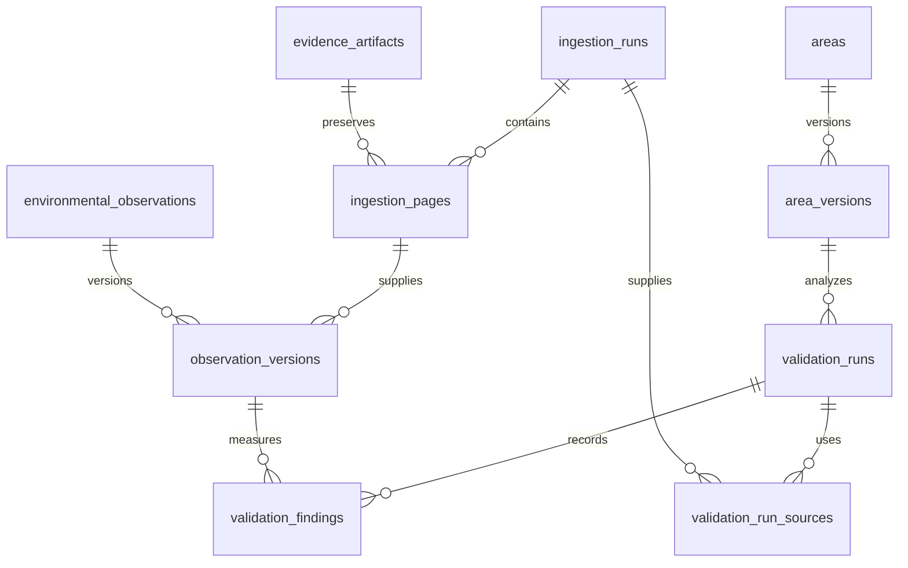

# Database model

PostgreSQL/PostGIS stores validation history. Migrations
[002](../../packages/database/migrations/002-provider-independent-model.sql) and
[003](../../packages/database/migrations/003-validation-persistence.sql) define the
model; `PostgisValidationRepository` connects it to the API.

## Identity and tables

Internal keys are PostgreSQL `bigint GENERATED ALWAYS AS IDENTITY`. The `pg` driver
returns them as decimal strings; keep that representation to avoid JavaScript
number precision loss. The API exposes a separate unique UUID in
`validation_runs.public_id`.

Provider identifiers are scoped by provider, dataset, and record namespace
(layer). Each unauthenticated request creates a new `analysis_area`; caller
`property_id`/`plot_id` values stay in the request snapshot and do not merge areas.

| Table                                             | Stores                                                                                 |
| ------------------------------------------------- | -------------------------------------------------------------------------------------- |
| `areas`, `area_external_references`               | Internal area identity and namespaced external references                              |
| `area_versions`                                   | Immutable geometry revisions in EPSG:4326, indexed with GiST                           |
| `data_sources`, `source_records`                  | Provider/dataset identity and namespaced external records                              |
| `environmental_observations`, `observation_kinds` | One observation per source record and a classification vocabulary, initially `unknown` |
| `observation_versions`                            | Geometry, temporal semantics, classification, page locator, and normalizer version     |
| `evidence_artifacts`                              | Raw payload hash, media type, byte length, and storage key                             |
| `ingestion_runs`, `ingestion_pages`               | Query context, adapter/version, counts, and ordered page receipts                      |
| `validation_runs`                                 | Fixed inputs, methodology, processing/runtime versions, execution state, and decision  |
| `validation_run_sources`                          | Collections used by a validation and their coverage assessments                        |
| `validation_findings`                             | Per-observation measurements or geometry issues                                        |
| `validation_run_outputs`                          | Exact result or sanitized error, plus verified archive receipts                        |



## Geometry and dates

Geometry columns require nonempty, valid, positive-area 2D Polygon/MultiPolygon
values in EPSG:4326 with longitude/latitude bounds. Insertion performs no repair or
reprojection; importers must transform other coordinate systems first.

An invalid source geometry is retained in its raw page. Its observation revision
uses `geom = NULL` with a required `geometry_issue`, and its finding has NULL
measurements. Zero means a measured zero intersection. Constraints reject NaN,
infinity, negative areas, and percentages outside 0–100. Event areas remain
independent; there is no aggregated union.

`temporal_basis` distinguishes observation, occurrence, reporting period, and
unknown. `temporal_precision` supports day, month, year, interval, and unknown.
Date bounds must be paired and ordered; day bounds must match. Unknown semantics
cannot carry invented bounds. The current adapter's `prodes-year` maps to
`reporting_period / year` with a label such as `2024` and NULL bounds.

## API write sequence

1. Validate the property, then create an area revision and a `running` validation
   with the original input and processing/runtime versions.
2. Fetch source pages and archive their exact bytes. Store raw data outside JSONB,
   since parsing and reserializing can change payload hashes.
3. Measure events, then use one transaction to store source collections, page
   receipts, observation revisions, findings, and the exact response. Finalize
   the run as `completed` before returning HTTP 200.
4. On failure after run creation, store a sanitized error and available verified
   receipts, then finalize as `failed`/`ERROR`. Partial collections are not saved
   as complete collections or used for a decision.

The first validation attachment verifies page totals and seals its collection.
Even an empty successful collection needs an archived empty response. Composite
foreign keys ensure each observation revision and finding references the correct
source and collection. Observation locks allocate revision numbers consistently
across concurrent validations.

Versions, artifacts, page receipts, source associations, and findings reject
UPDATE/DELETE. Run inputs are fixed; finalized runs reject further writes.
Reprocessing creates new revisions and runs. These constraints do not replace
database permissions: routine application roles should not own tables or have
TRUNCATE/DDL privileges.

## Operations

`GET /validations/:validationId` returns saved input, result/error, state, and
provenance without querying sources. It does not serve raw archive files.
Processing fingerprints hash loaded API/library code and the lockfile; runtime
metadata records Node, PostgreSQL, and PostGIS/GEOS/PROJ versions.

Back up the database, raw archive, and matching code together. Filesystem writes
and SQL transactions are separate, so failures can leave unreferenced files. A
crash or unavailable database can also leave a run `running` without a result;
automatic recovery is not implemented.

Migration 001's legacy tables remain intact; new requests use the new model.
Migrations run transactionally and are recorded in `schema_migrations`. Applied
files must not be edited; add a numbered forward migration instead.

```bash
pnpm db:migrate
pnpm test:integration
```

Both commands use `DATABASE_URL`. Model tests roll back their fixtures. API tests
create and drop a randomly named disposable database to exercise real commits,
concurrent requests, and restart/retrieval, so the test role needs CREATEDB.
Source responses are synthetic; tests require PostGIS but no WFS access.
