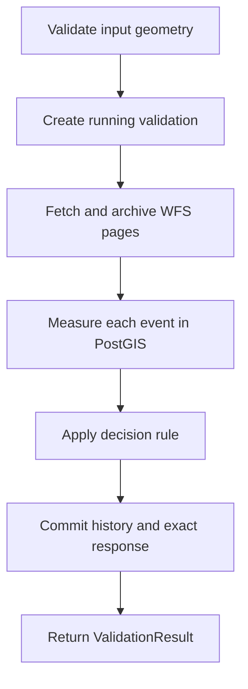

# Environmental validation flow

`validateEnvironmentalOrigin` coordinates source retrieval, geometry analysis, and
the decision rule. The TerraBrasilis adapter supplies events, coverage assessments,
and page receipts. It preserves date precision, requests EPSG:4326, and rejects
incomplete pagination. The cutoff travels as a UTC date; its interpretation is
specified in [JADE-ENV-0.1](../methodology/JADE-ENV-0.1.md).

PostGIS checks geometry without repair and measures intersections in m². The
[geometry policy](../research/geometry-crs-policy.md) defines the operations and
limitations. The default decision remains INCONCLUSIVE while the methodology is
draft; proposal tests use an explicitly injected decision rule.

The API commits input, source references, measurements, processing versions, and
response before returning success. Failures retain their error and any archived
receipts. GET reads saved history without calling WFS. See the
[database model](database-model.md) for transaction and recovery details.

## Evidence and attestation

| Hash           | Subject                                | Status                                            |
| -------------- | -------------------------------------- | ------------------------------------------------- |
| `payloadHash`  | Exact retrieved source body            | Implemented; verified when archived and read      |
| `geometryHash` | Submitted or normalized geometry bytes | Representation and normalization remain undecided |
| `evidenceHash` | Canonical manifest bytes               | Canonicalization strategy remains undecided       |

`hashEvidence(manifest, canonicalizer)` hashes the strategy's exact bytes with
SHA-256. Omitting the strategy throws. The manifest excludes its own hash.
Unmeasured areas are null; per-event areas cannot be summed without an overlap
policy.

The API does not yet construct manifests or submit transactions. The contract
stores an authorized attestation hash/result and permits revocation; the future
Stellar adapter must convert 64-character hex hashes to `BytesN<32>`. Contract
storage does not verify environmental conclusions.
