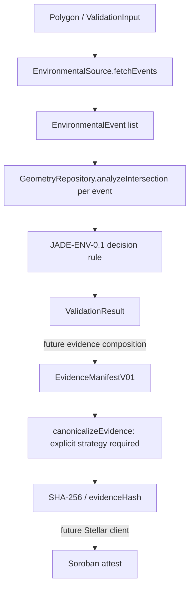

# Environmental screening to attestation

`validateEnvironmentalOrigin` passes the input geometry and date to a source,
analyzes each event through `GeometryRepository`, and forwards both the original
events and per-event measurements to a separate decision rule. No source-specific
layer names, source hierarchy or blockchain types appear in the workflow.

The transport Date uses UTC midnight for the input calendar date. This does not
select cutoff inclusivity, source timestamp semantics, or a scientific temporal
rule. Event date values retain their stated precision and may be null.

The TerraBrasilis adapter has a generic native-fetch transport method returning
`unknown`. Its high-level `fetchEvents` deliberately throws before using it until
mapping, spatial/temporal filters and completeness/pagination are researched.
There are no hardcoded government endpoints or layers.

The PostGIS adapter also throws until its SQL and policy exist. Its return type
states the measurements that callers need, not how those measurements are to be
computed. The decision rule throws even for an empty event array. A mock source,
mock geometry repository and explicit test decision make the full orchestration
executable in isolation without doing the interns' research.

## Evidence boundary

`EvidenceManifestV01` is provisional. Its methodology identifier is a version label,
not a claim that the method has been implemented or approved. An evidence manifest
must eventually carry provenance sufficient to reproduce a screening result.

| Hash         | Intended subject                                                   | Resolution                                                                                                                                        |
| ------------ | ------------------------------------------------------------------ | ------------------------------------------------------------------------------------------------------------------------------------------------- |
| geometryHash | submitted geometry, unnormalized, as validated by `GeometrySchema` | JCS canonical bytes of the geometry, WGS84 implied by GeoJSON; precision/normalization still a GIS decision — `docs/research/evidence-hashing.md` |
| payloadHash  | one retrieved source response's raw bytes                          | raw bytes, pre-parsing, pages concatenated in fetch order — `docs/research/evidence-hashing.md`                                                   |
| evidenceHash | canonical bytes of the complete evidence manifest                  | RFC 8785 (JCS) over the full `EvidenceManifestV01` — `docs/research/evidence-hashing.md`                                                          |

These hashes are distinct and must never substitute for one another. The manifest
does not contain its own evidenceHash. SHA-256 returns lowercase 64-character hex;
the initial contract accepts `BytesN<32>`. The future Stellar adapter must convert
and validate the representation explicitly.

`hashEvidence(manifest, canonicalizer)` calls the canonicalizer and hashes its exact
bytes with Node `node:crypto`. Omitting the strategy throws; no `JSON.stringify`
fallback exists. `jcsEvidenceCanonicalizer` (`packages/evidence/src/jcs-canonicalizer.ts`)
is the supplied RFC 8785 implementation, passed explicitly by callers. `hashGeometry`
and `hashPayload` (`packages/evidence/src/`) implement `geometryHash` and
`payloadHash` the same way, ready for the future manifest-composition layer to call.

Manifest summary areas may be null when unmeasured. Zero requires a measurement.
Per-event areas cannot automatically be summed because events may overlap;
aggregate/union semantics are a research decision. The initial app does not
construct manifests or send on-chain transactions.

The contract validates authorization and preserves an attestation hash/result. It
does not independently validate source truth, environmental conclusions or legal
compliance. Revocation changes status while preserving the original evidence hash.
