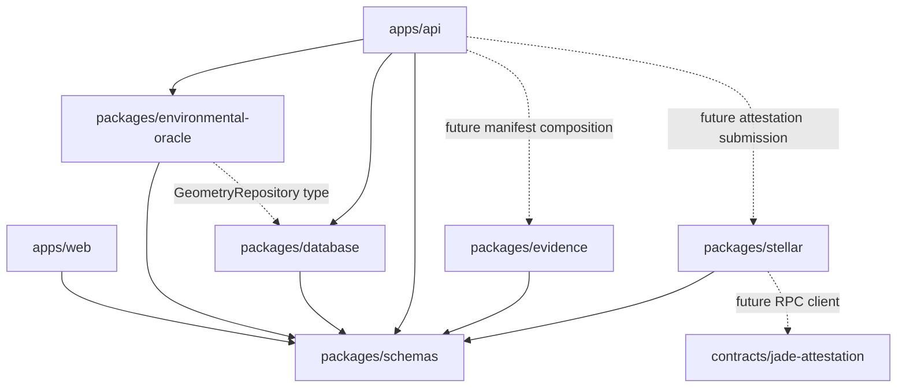

# Monorepo boundaries

This is one repository with two small workspaces: pnpm for off-chain TypeScript,
Cargo for Rust smart contracts. Packages expose compiled ESM and declarations
through their package exports. Recursive pnpm builds follow declared workspace
dependencies; tests and dev commands prepare package outputs first.

| Module                        | Responsibility                                           | Owner      |
| ----------------------------- | -------------------------------------------------------- | ---------- |
| apps/web                      | minimal Vite/React workspace verification                | researcher |
| apps/api                      | HTTP schemas, error mapping, dependency composition      | researcher |
| packages/schemas              | TypeBox runtime schemas + static shared types            | shared     |
| packages/database             | pg connection lifecycle, SQL migrations, geospatial port | Intern 2   |
| packages/environmental-oracle | source → intersections → decision orchestration          | Intern 2   |
| packages/evidence             | manifest export, canonicalization boundary, SHA-256      | Intern 1   |
| packages/stellar              | off-chain contract communication port                    | Intern 1   |
| contracts/jade-attestation    | authorization and attestation records only               | Intern 1   |

Domain packages cannot import apps or Fastify. The oracle cannot import Stellar.
ESLint enforces these imports in source files; pnpm manifests express the actual
dependency graph. The geometry repository interface is the only database type
needed by the oracle. No DI container, decorators or generic repository framework
is used. Two classes implement actual adapter boundaries, not domain hierarchies.

TypeBox is the sole schema system. Fastify registers the recursive GeoJSON schema
and validates its references. Geometry shape checks are not topology validation.
The public request accepts structural GeoJSON geometries; deciding which geometry
types the environmental methodology supports remains a research decision.

The initial SQL migration creates two prototype tables and a small migration
ledger. Inputs remain JSON pending a normalization/storage decision. There is no
automatic conversion into a chosen processing CRS and no request persistence
workflow yet. SQL is versioned and visible; the intersection SQL file is an
explicitly non-executable research worksheet.

The shared error for incomplete boundaries is an engineering signal, not an
environmental verdict. The API maps it to 501; transport outages to 503; unexpected
failures to 500. The methodology must decide if and how those become recorded
`ERROR` or `INCONCLUSIVE` results later.

The tiny frontend uses both a shared TypeScript type and a runtime schema to verify
workspace resolution. It has no authentication, map, wallet, dashboard or workflow.
