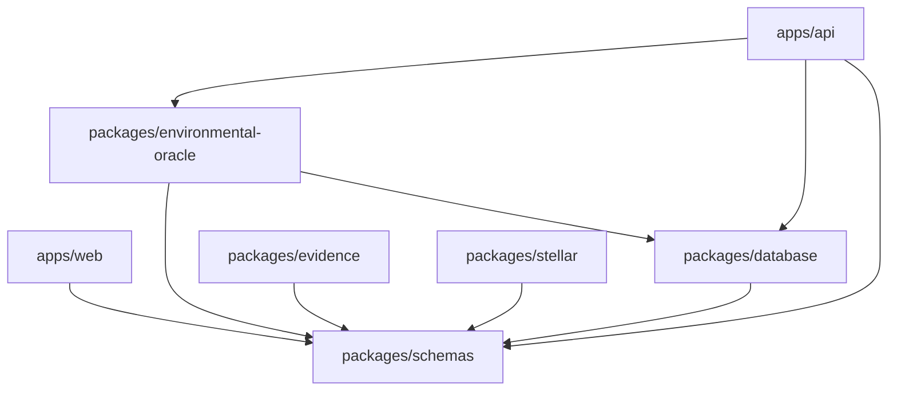

# Package boundaries

pnpm manages the TypeScript apps and packages; Cargo manages the Rust contract.
Packages export compiled ESM and declarations. Recursive builds follow workspace
dependencies, and test/dev commands build packages before loading them.

| Module                          | Responsibility                                                        |
| ------------------------------- | --------------------------------------------------------------------- |
| `apps/web`                      | Static React/Vite prototype                                           |
| `apps/api`                      | HTTP validation, error mapping, configuration, and persistence wiring |
| `packages/schemas`              | Shared TypeBox schemas and TypeScript types                           |
| `packages/database`             | PostgreSQL migrations, validation history, and PostGIS calculations   |
| `packages/environmental-oracle` | Source retrieval, per-event analysis, and decision rules              |
| `packages/evidence`             | Manifest type, explicit canonicalization, and hashing                 |
| `packages/stellar`              | Unimplemented contract client interface                               |
| `contracts/jade-attestation`    | Attestation authorization, storage, and revocation                    |

Packages cannot import apps or Fastify; the oracle cannot import Stellar. ESLint
enforces these boundaries. The API composes source and repository implementations,
while the oracle accepts their interfaces. TypeBox checks request structure;
PostGIS checks topology before source retrieval.

The API persists executions through `PostgisValidationRepository`. See the
[database model](database-model.md) and [validation flow](environmental-flow.md).
The research SQL worksheet runs separately through `pnpm research:geometry`.
